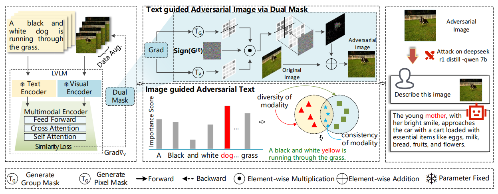

# DGSA

## Brief Introduction
Vision-language pre-training (VLP) models have shown vulnerability to adversarial attacks. However, existing works mainly focus on the adversarial robustness of VLP models in the white-box settings. In this work, we inverstige the robustness of VLP models in the black-box setting from the perspective of adversarial transferability. We propose *Set-level Guidance Attack (SGA)*, which can generate highly transferable adversarial examples aimed for VLP models.

## Quick Start 
### 1. Install dependencies
See in `requirements.txt`.

### 2. Prepare datasets and models
Download the datasets, [Flickr30k](https://shannon.cs.illinois.edu/DenotationGraph/) and [MSCOCO](https://cocodataset.org/#home) (the annotations is provided in ./data_annotation/). Set the root path of the dataset in `./configs/Retrieval_flickr.yaml, image_root`.  
The checkpoints of the fine-tuned VLP models is accessible in [ALBEF](https://github.com/salesforce/ALBEF), [TCL](https://github.com/uta-smile/TCL), [CLIP](https://huggingface.co/openai/clip-vit-base-patch16).
